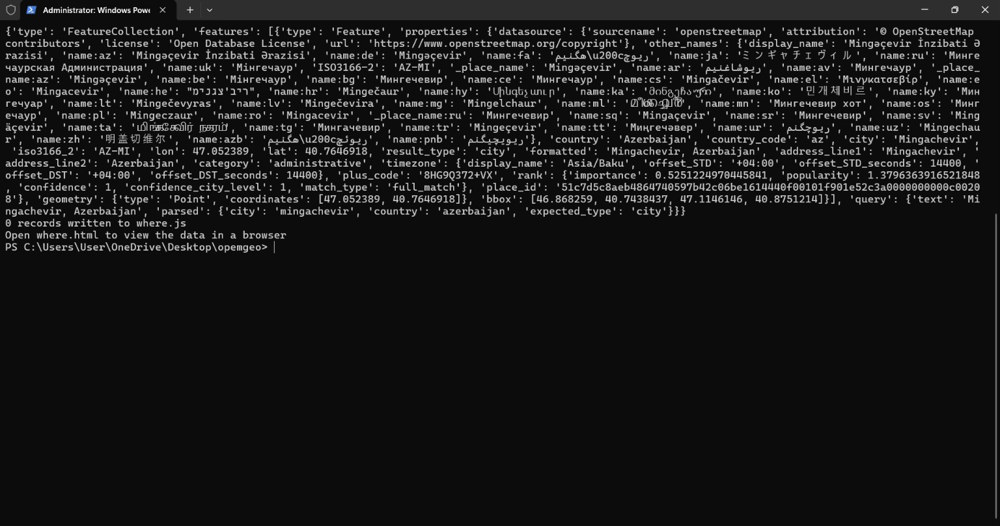
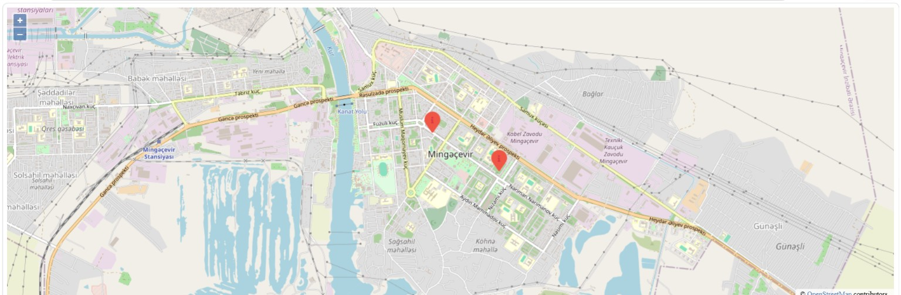
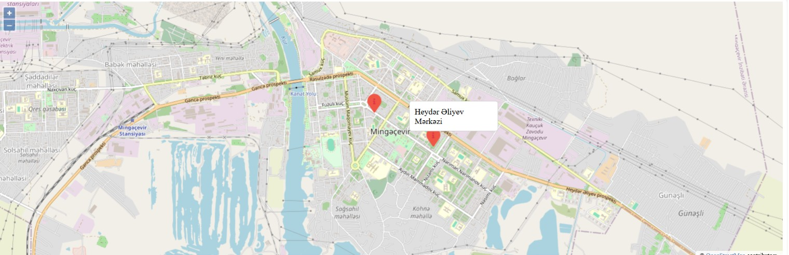

# Python Capstone Project: Geodata Visualization

This project demonstrates the process of retrieving geographical data using the OpenStreetMap API (Nominatim), storing it in an SQLite database, and visualizing the locations on an interactive map.

## Project Workflow
The project is divided into two main phases to ensure efficient API usage and data management[cite: 4]:

*   **Data Retrieval (`geoload.py`)**: Reads addresses from `where.data`, retrieves geocoding data from the OpenStreetMap API, and stores it in `opengeo.sqlite`[cite: 4].
*   **Visualization (`geodump.py`)**: Reads the processed data from the database, generates a `where.js` file, and enables visualization via `where.html`[cite: 4].

## Results (Screenshots)

### 1. Terminal Execution

### 2. Map Visualization

## Requirements
*   **Database Browser**: [DB Browser for SQLite](https://sqlitebrowser.org/) is recommended for viewing and modifying the database[cite: 4].
*   **Terminal**: PowerShell is recommended for Windows users to properly display UTF-8 characters[cite: 4].

## Certificate
[Course 5 Completion Certificate](https://www.coursera.org/account/accomplishments/certificate/TWDTVGK3WHGK)
